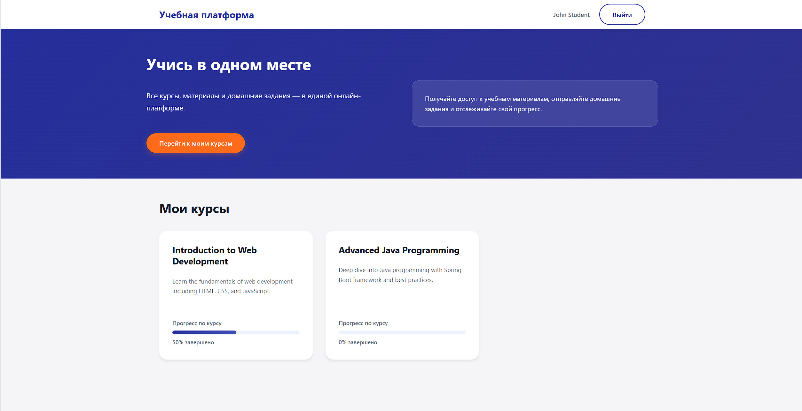
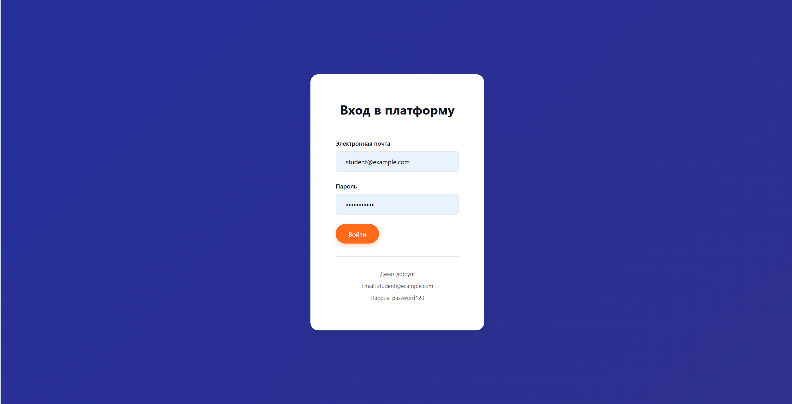
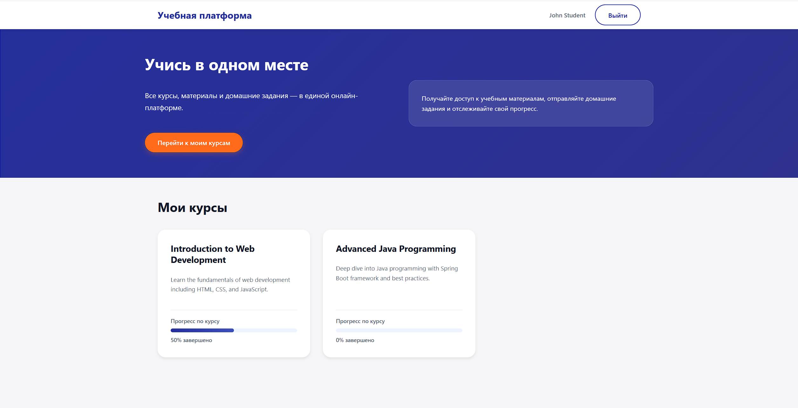
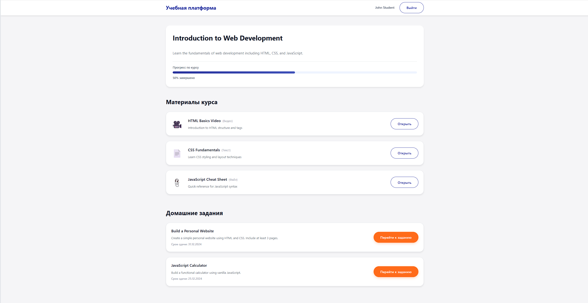
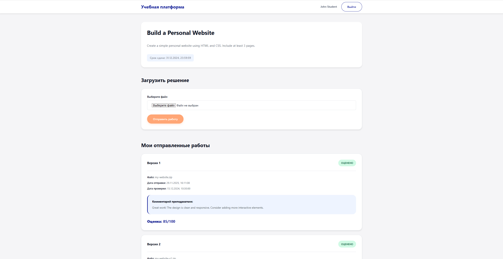

# Student Platform - Hackathon MVP

Образовательная платформа для студентов: просмотр курсов, доступ к учебным материалам, отправка домашних заданий и просмотр обратной связи от преподавателей.


*Главная страница с hero-секцией и списком курсов*
g
## Технологический стек

- **Backend**: Java 17 + Spring Boot 3.2.0 + PostgreSQL
- **Frontend**: React 18 + TypeScript + Vite
- **База данных**: PostgreSQL 15
- **Контейнеризация**: Docker + Docker Compose

## Структура проекта

```
.
├── backend/                 # Spring Boot приложение
│   ├── src/
│   │   └── main/
│   │       ├── java/        # Исходный код Java
│   │       └── resources/  # Конфигурация и SQL скрипты
│   ├── Dockerfile
│   └── pom.xml
├── frontend/               # React + TypeScript приложение
│   ├── src/
│   │   ├── pages/          # Компоненты страниц
│   │   ├── components/     # Переиспользуемые компоненты
│   │   ├── api/            # API клиент и типы
│   │   └── styles/         # CSS файлы
│   ├── Dockerfile
│   ├── nginx.conf
│   └── package.json
├── screenshots/            # Скриншоты для документации
├── docker-compose.yml      # Docker оркестрация
└── README.md
```

## Быстрый старт с Docker

### Требования

- Docker Desktop (или Docker Engine + Docker Compose)
- Минимум 2GB свободного места на диске

### Запуск приложения

1. **Клонируйте или перейдите в директорию проекта**

2. **Запустите все сервисы через Docker Compose:**
   ```bash
   docker-compose up --build
   ```

   Это выполнит:
   - Сборку backend Spring Boot приложения
   - Сборку frontend React приложения
   - Запуск PostgreSQL базы данных
   - Инициализацию базы данных со схемой и тестовыми данными
   - Запуск всех сервисов

3. **Доступ к приложению:**
   - Frontend: http://localhost
   - Backend API: http://localhost:8080/api
   - Документация API: http://localhost:8080/swagger-ui.html

   
   *Документация API в Swagger UI*

4. **Учетные данные для входа:**
   - Email: `student@example.com`
   - Пароль: `password123`

   
   *Страница входа в систему*

### Остановка приложения

```bash
docker-compose down
```

Для удаления томов (данные базы и загруженные файлы):
```bash
docker-compose down -v
```

## Запуск локально (без Docker)

### Требования

- Java 17 JDK
- Maven 3.6+
- Node.js 18+
- PostgreSQL 15

### Настройка Backend

1. **Создайте базу данных PostgreSQL:**
   ```sql
   CREATE DATABASE studentplatform;
   CREATE USER studentuser WITH PASSWORD 'studentpass';
   GRANT ALL PRIVILEGES ON DATABASE studentplatform TO studentuser;
   ```

2. **Запустите SQL скрипты:**
   ```bash
   psql -U studentuser -d studentplatform -f backend/src/main/resources/db/schema.sql
   psql -U studentuser -d studentplatform -f backend/src/main/resources/db/data.sql
   ```

3. **Перейдите в директорию backend:**
   ```bash
   cd backend
   ```

4. **Соберите и запустите:**
   ```bash
   mvn clean install
   mvn spring-boot:run
   ```

   Backend будет доступен на http://localhost:8080

### Настройка Frontend

1. **Перейдите в директорию frontend:**
   ```bash
   cd frontend
   ```

2. **Установите зависимости:**
   ```bash
   npm install
   ```

3. **Запустите dev сервер:**
   ```bash
   npm run dev
   ```

   Frontend будет доступен на http://localhost:3000

## Основные функции

### Страница курсов


*Список доступных курсов с прогрессом*

- Просмотр всех доступных курсов
- Отображение прогресса по каждому курсу
- Переход к детальной информации о курсе

### Страница курса


*Детальная информация о курсе с материалами и заданиями*

- Просмотр материалов курса (видео, тексты, файлы)
- Список домашних заданий
- Индикатор прогресса по курсу

### Страница задания


*Страница задания с формой загрузки и историей отправок*

- Просмотр описания задания
- Загрузка файла с решением
- Просмотр всех отправленных версий
- Комментарии и оценки от преподавателя

### История отправок


*Список всех отправленных работ с комментариями*

- Версионирование отправок
- Статусы: Отправлено, Проверено, Оценено
- Комментарии преподавателя
- Оценки за работы

## API Endpoints

### Аутентификация
- `POST /api/auth/login` - Вход с email и паролем

### Курсы
- `GET /api/courses` - Получить все курсы
- `GET /api/courses/{courseId}` - Получить детали курса
- `GET /api/courses/{courseId}/materials` - Получить материалы курса
- `GET /api/courses/{courseId}/assignments` - Получить задания курса
- `GET /api/courses/{courseId}/progress?studentId={id}` - Получить прогресс по курсу

### Задания
- `GET /api/assignments/{assignmentId}` - Получить детали задания
- `GET /api/assignments/{assignmentId}/submissions?studentId={id}` - Получить отправки студента
- `POST /api/assignments/{assignmentId}/submit?studentId={id}` - Отправить задание (multipart/form-data)

## Возможности

- ✅ Аутентификация пользователей (упрощенная для hackathon)
- ✅ Просмотр списка курсов и деталей
- ✅ Учебные материалы (видео, текст, файлы)
- ✅ Отправка заданий с загрузкой файлов
- ✅ Версионирование отправок
- ✅ Комментарии и оценки преподавателя
- ✅ Отслеживание прогресса
- ✅ Адаптивный дизайн UI

## Конфигурация

### Конфигурация Backend

Отредактируйте `backend/src/main/resources/application.yml`:

```yaml
spring:
  datasource:
    url: jdbc:postgresql://localhost:5432/studentplatform
    username: studentuser
    password: studentpass
  servlet:
    multipart:
      max-file-size: 100MB
      max-request-size: 100MB

app:
  upload:
    dir: uploads
```

### Конфигурация Frontend

Создайте `frontend/.env` для локальной разработки:

```
VITE_API_URL=http://localhost:8080/api
```

## Лицензия

Это hackathon проект - используйте и модифицируйте по необходимости.
=======


Команда: potompridymaem
Беляев Влад - Frontend + UI/UX
Фалин Влад - Backend
Карим - Backend
Айдар - Database architect
Данил - Presenter